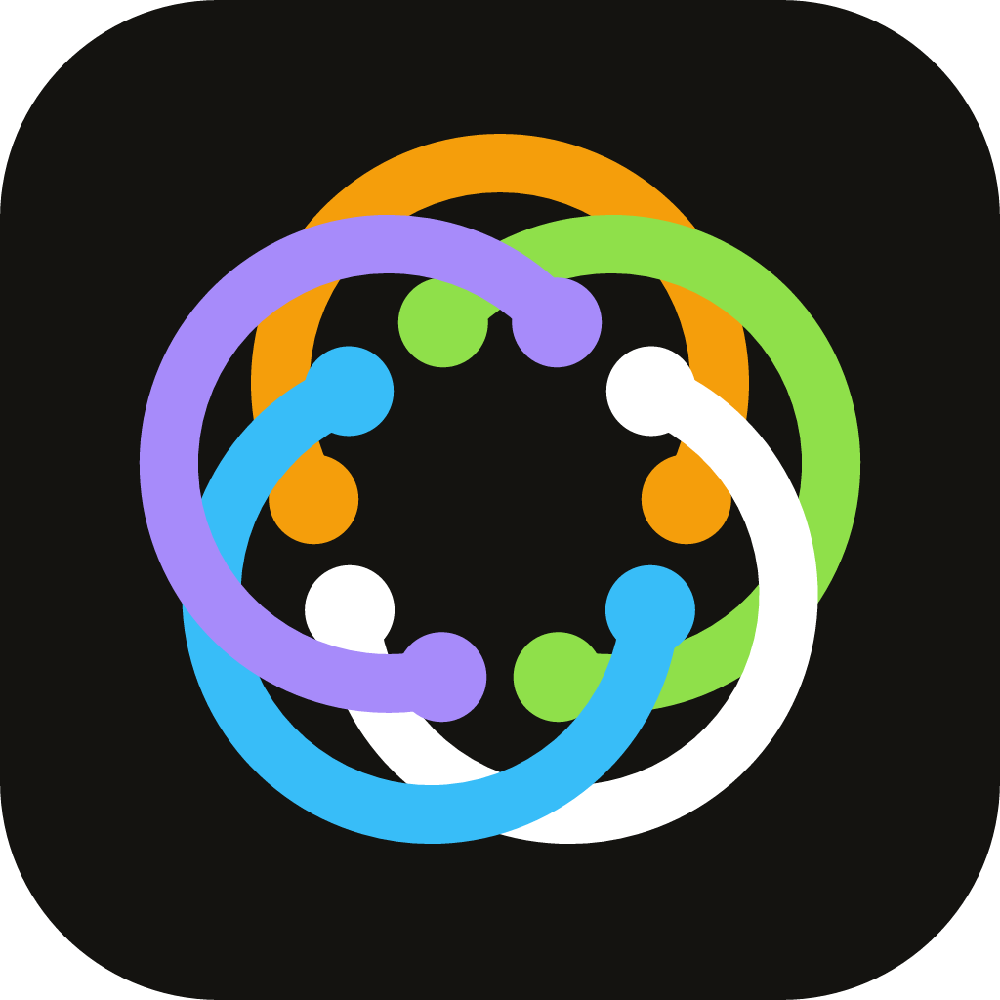

# Gyredeck

<p align="center">
  
</p>

<p align="center">
  A local macOS menu-bar companion for AI coding agents — live agent sessions, provider usage, listening ports, and GitHub/GitLab repo/CI/PR monitoring, in a window from the menu bar.
</p>

<p align="center">
  <strong>Local-first</strong> · <strong>Menu-bar window</strong> · <strong>Claude Code · Codex · Antigravity</strong>
</p>

---

## Install

macOS (Apple Silicon or Intel). Paste this into a terminal:

```sh
curl -fsSL https://raw.githubusercontent.com/j-kizt/gyredeck-macos/main/scripts/install.sh | bash
```

It downloads the latest release, installs **Gyredeck.app** to `/Applications`, and opens it. The app is self-signed (not Apple-notarized), so the installer clears the quarantine flag for you; after that, updates are handled in-app via **Settings → Update**.

Prefer to do it by hand? Download `Gyredeck_*.app.tar.gz` from the [latest release](https://github.com/j-kizt/gyredeck-macos/releases/latest), unpack it, and drag the app into `/Applications` (first launch: right-click → Open).

## Connect your agent

The app needs a hook to see your sessions. After installing, click the menu-bar icon and open **Settings → Plugins**:

- **Claude Code** — install the Claude Code hook, then start a new Claude Code session. Rich per-tool activity.
- **Antigravity** — install the Antigravity hook the same way.
- **Codex** (optional) — full hook presence: sessions, turns, tool calls, approvals and compaction. Install from Settings → Plugins.

## What it shows

| Tab | What it shows |
| --- | --- |
| **Sessions** | Workspace-grouped agent sessions with live activity (turn / tool / compaction / done / needs-input), recent-activity detail, clear/dismiss, and a Focus button that jumps to the matching terminal |
| **Usage** | Local quota/token views for known providers (Claude Code, Codex, Antigravity), in-use providers first; truthful unavailable/offline states |
| **Listening Ports** | Locally listening TCP/HTTP services named from their command line, with open-in-browser and guarded stop controls |
| **Git Monitor** | Per-repo latest commit, CI status (GitHub Actions / GitLab pipelines), and open PRs/MRs across **GitHub & GitLab**; add repos from a picker, sign in via OAuth device flow or import from `gh`/`glab`, and switch/manage accounts inline |

**Settings** (gear) is grouped into **Connection** (bridge status + configurable local port), **Display**, **Git** (built-in credential helper, account list, and git-identity sync), **Plugins** (agent hooks), and **Update** (current version + check/install updates). It also holds the **Terminal** picker (iTerm2 / Ghostty) used by session Focus, and Keep-display-awake.

## Privacy

- Everything runs locally on `127.0.0.1`; nothing is uploaded.
- The bridge stores tool status and output length, not raw tool output; user-text previews are off by default.
- Git accounts are stored locally under `~/.config/gyredeck` (OAuth device-flow tokens, or imported from `gh`/`glab`); the optional built-in credential helper serves `git push`/`pull` without needing those CLIs. Switching accounts can optionally sync your global git identity (toggle in **Settings → Git**).

## Notes

- No real "end session" control (Claude Code exposes no stable scoped API for it).
- Terminal Focus matches iTerm2 or Ghostty by cwd/title — it is not a process/session-control API.

## Credits

- **Origin:** [agent-halo](https://github.com/mahirocoko/agent-halo) by Mahiro — the local bridge, presence protocol, and desktop shell this project is built on.
- **This fork:** Letta-free rebuild by J-Kitz — Claude Code / Codex / Antigravity hook adapters, GitHub/GitLab repo/CI/PR monitor, menu-bar window, and signed auto-update.
- Local usage-provider research is informed by [OpenUsage](https://github.com/robinebers/openusage).

---

Building from source or contributing? See [`.claude/context/development.md`](.claude/context/development.md).
